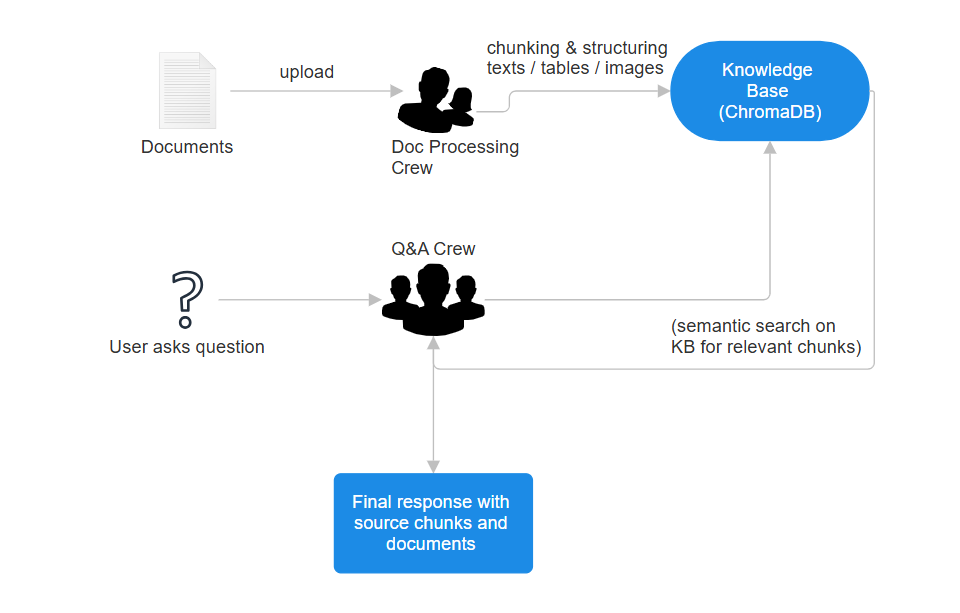

# AADIS

Advanced Agentic Document Intelligence System is a FastAPI-based backend service that allows users to upload documents, extract their contents (text and tables), and perform question answering over the processed documents using agent-based orchestration.


## Features

```bash
User ↔ AADIS
    ├── /upload-documents/ → DocumentProcessingCrew → KnowledgeBase
    ├── /ask-question/     → QACrew → KnowledgeBase
    ├── /documents/        → KnowledgeBase
    └── /documents/{id}    → KnowledgeBase
```
The above figure shows the working of the agentic system with the endpoints used.

1. The Document Processing Crew consists of a text extraction 
   agent and a table extraction agent. These two agents process the documents and store it in the KnowledgeBase.

2. The QA Crew consists of a text retrieval agent and a table 
   analysis agent. These 2 agents are supervised by a Supervisor agent that delegates tasks based on the question asked and finally retrieve relevant data from the Knowledge Base. 

3. The final two endpoints are just to list out the documents and to delete any documents based on their ids.



## Installation

First install the requirements

```bash
pip install -r requirements.txt
```
Then run the fastapi backend using
```bash
python main.py
```
To input questions in natural language, run the streamlit frontend
```bash
streamlit run frontend.py
```
## FastAPI Backend

The FastAPI backend takes in a json payload as a question input and also outputs a json payload with the relevant data as shown below. 

Note : The output is dissimilar if we use the streamlit frontend. It will only output the answer.

-------------------------------------------------------------
Input 

```bash
{
    "question" : "This is a sample question?"
}
```

Output 

```bash
{
    "answer": str(result),
    "sources": [
            f"Text chunks: {len(relevant_texts)}",
            f"Tables: {len(relevant_tables)}"
               ],
    "agent_used": agent_used
}
```
## Overview of models, libraries used and challenges faced etc.


1. Used CrewAI for agentic orchestration due to more experience with that. It also has a clean architecture and the code is simpler to understand.

2. ChromaDB used as a vector database for texts chunks and table storage. It acts as a knowledge base

3. Main LLM used for text and table retrieval and analysis is llama-3.3-70b-versatile through Groq, mainly due to free availability and decent context awareness. 
  In production I would ideally use gemini-2.5-pro for the massive context size since this would be used in big companies with a lot of data.

4. Thing to note : During writing the table analysis and retrieval agent, it appeared the text retrieval works near-perfectly for tables in pdfs in the provided dataset. On the other hand, pdf retrieval dor docx files does exist. We can implement a robust table analysis tool for pdfs but for the time being there seems no need for the same.

5. There have been major issues with image analysis due to not the best openly available image understand models. I have tried using llama-4-scout-17b-16e-instruct with some issues but to no avail so far since the images used in the sample dataset (of research papers) are complex. This will be fixed soon.